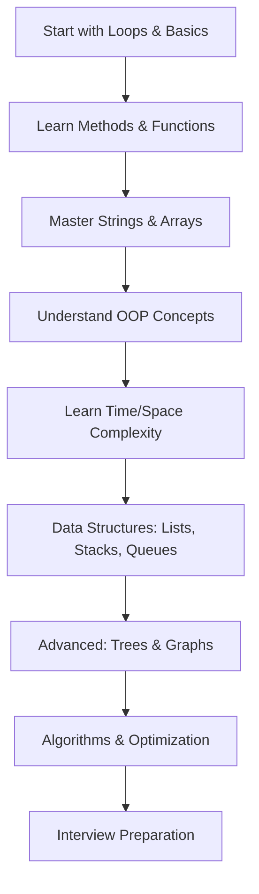

# 🚀 Data Structures & Algorithms in Java

<div align="center">


**A comprehensive collection of Data Structures and Algorithms implementations in Java**

[🔍 Explore](#-table-of-contents) • [🚀 Quick Start](#-quick-start) • [📚 Topics](#-topics-covered) • [🤝 Contributing](#-contributing)

</div>

---

## 📖 About This Repository

Welcome to the **DSA Java Series** - your one-stop destination for mastering Data Structures and Algorithms using Java! This repository contains well-organized, documented, and tested implementations of fundamental programming concepts, algorithms, and data structures.

Whether you're a **beginner** starting your programming journey or an **experienced developer** preparing for technical interviews, this repository has something valuable for you.

## ✨ Key Features

- 🎯 **Comprehensive Coverage**: From basic loops to advanced algorithms
- 📝 **Clean Code**: Well-commented and readable implementations
- 🏗️ **Structured Learning**: Progressive difficulty levels
- 🔄 **Practice Problems**: Real-world problem-solving examples
- 💡 **Interview Prep**: Common algorithmic questions and solutions
- 📊 **Time Complexity**: Analysis for better understanding

## 🚀 Quick Start

### Prerequisites

```bash
Java 8 or higher
IDE (IntelliJ IDEA, Eclipse, or VS Code)
```

### Clone the Repository

```bash
git clone https://github.com/Aashish1A/DSA_JAVA.git
cd DSA_JAVA
```

### Run Any Program

```bash
# Navigate to any folder and compile
javac FileName.java

# Run the program
java FileName
```

## 📚 Topics Covered

<details>
<summary><strong>🔄 00. Loops & Basics</strong></summary>

- Basic loop structures
- Pattern printing algorithms
- Geometric calculations
- Number sequences
- **Practice Problems** included

</details>

<details>
<summary><strong>🛠️ 01. Methods</strong></summary>

- Function definitions and calls
- Built-in function usage
- Mathematical combinations & permutations
- Pascal's Triangle implementation
- Variable swapping techniques

</details>

<details>
<summary><strong>📝 02. Strings</strong></summary>

- String manipulation basics
- StringBuilder operations
- Type conversions (String ↔ Int ↔ Char)
- Substring operations
- **Practice Questions** with solutions

</details>

<details>
<summary><strong>📊 03. Arrays</strong></summary>

- Array fundamentals and operations
- Linear search algorithms
- Input/output handling
- ArrayList implementations
- **Two-dimensional arrays**
- **Practice Questions** included

</details>

<details>
<summary><strong>🏗️ 04. Object-Oriented Programming</strong></summary>

- Class design and implementation
- Object creation and manipulation
- Real-world examples (Student, Fraction classes)
- Encapsulation principles

</details>

<details>
<summary><strong>⏱️ 05. Time & Space Complexity</strong></summary>

- Big O notation analysis
- Time complexity calculations
- Space optimization techniques
- Performance comparison

</details>

<details>
<summary><strong>🔗 06. Linked Lists</strong></summary>

- Singly Linked Lists
- Doubly Linked Lists
- Circular Linked Lists
- Menu-driven implementations
- **C language implementations** also included

</details>

<details>
<summary><strong>📚 07. Stacks</strong></summary>

- Stack implementation and operations
- Infix, Prefix, Postfix conversions
- Stack reversal algorithms
- Linked List-based stacks
- **Practice Problems** with solutions

</details>

<details>
<summary><strong>🚶‍♂️ 08. Queues</strong></summary>

- Array-based queue implementation
- Linked List-based queues
- Circular queues
- Double-ended queues (Deque)
- **Priority queues**

</details>

<details>
<summary><strong>🗂️ 09. Collection Frameworks</strong></summary>

- ArrayList and LinkedList
- HashMap and TreeMap
- HashSet and TreeSet
- Stack and Queue collections
- Priority Queue examples

</details>

<details>
<summary><strong>🔄 10. Recursion</strong></summary>

- Factorial calculations
- Fibonacci sequences
- Power functions
- Tower of Hanoi
- Path counting problems

</details>

<details>
<summary><strong>🌳 11. Trees</strong></summary>

- Binary Trees
- Binary Search Trees
- AVL Trees
- B and B+ Trees
- Tree traversal algorithms

</details>

<details>
<summary><strong>🔧 12. Algorithms</strong></summary>

- **Sorting**: Bubble, Selection, Insertion, Merge, Quick, Radix, Count Sort
- **String Matching**: Karp-Rabin algorithm
- **Search Algorithms**: Binary search, linear search
- Time complexity analysis for each

</details>

<details>
<summary><strong>🗂️ 13. HashMap & Hashing</strong></summary>

- Hash table implementations
- Collision resolution techniques
- Hash function design
- Real-world applications

</details>

<details>
<summary><strong>📦 14. HashSet</strong></summary>

- Set operations and implementations
- Duplicate elimination
- Set theory applications

</details>

<details>
<summary><strong>🔙 15. Backtracking</strong></summary>

- N-Queens problem
- Sudoku solver
- Maze solving algorithms
- Permutation generation

</details>

<details>
<summary><strong>🔍 16. Searching</strong></summary>

- Linear search variations
- Binary search and its applications
- Ternary search
- Exponential search

</details>

<details>
<summary><strong>⚡ 17. Bit Manipulation</strong></summary>

- Bitwise operations
- Bit masking techniques
- Power of 2 checks
- XOR applications

</details>

## 🎯 Learning Path



## 💡 How to Use This Repository

1. **Sequential Learning**: Follow the numbered folders for structured learning
2. **Topic-wise Study**: Jump to specific topics based on your needs
3. **Practice Problems**: Solve the practice questions in each section
4. **Code Review**: Analyze the implementations and understand the logic
5. **Modify & Experiment**: Try variations of the given problems

## 📊 Complexity Analysis

Each algorithm includes:

- ⏰ **Time Complexity**: Big O notation analysis
- 💾 **Space Complexity**: Memory usage patterns
- 📈 **Best/Average/Worst Case**: Scenario-based analysis

## 🤝 Contributing

We welcome contributions! Here's how you can help:

1. **🍴 Fork** the repository
2. **🌿 Create** a feature branch (`git checkout -b feature/AmazingFeature`)
3. **💻 Commit** your changes (`git commit -m 'Add some AmazingFeature'`)
4. **📤 Push** to the branch (`git push origin feature/AmazingFeature`)
5. **🔀 Open** a Pull Request

### Contribution Guidelines

- Follow Java naming conventions
- Add comments for complex logic
- Include time/space complexity analysis
- Add test cases for new algorithms
- Update documentation as needed

## 📞 Connect & Support

<div align="center">

**Found this helpful? Give it a ⭐!**

[](https://github.com/Aashish1A)
[](https://linkedin.com/in/aashish1a)

</div>

## 📄 License

This project is licensed under the MIT License - see the [LICENSE](LICENSE) file for details.

## 🙏 Acknowledgments

- Thanks to all contributors who help improve this repository
- Inspired by the programming community's spirit of knowledge sharing
- Special thanks to educators and content creators in the DSA space

---

<div align="center">

**Happy Coding! 🚀**

_"The only way to learn a new programming language is by writing programs in it."_ - Dennis Ritchie

</div>
